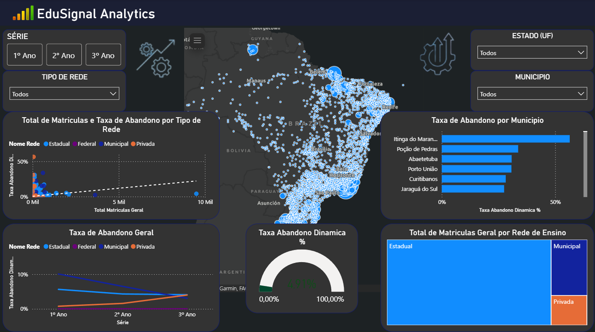

# 📊 EduSignal Analytics: Inteligência de Dados na Educação Brasileira

O **EduSignal** é um ecossistema de inteligência de dados projetado para monitorar e analisar o fluxo escolar no Brasil. Utilizando microdados reais do **INEP** (Censo Escolar e Taxas de Rendimento), o projeto transforma milhões de registros brutos em insights acionáveis para combater a evasão e o abandono escolar.

## 🎯 O Problema
A média nacional de educação muitas vezes esconde "bolhas" críticas de evasão. O EduSignal foca em identificar esses gargalos específicos, como a transição do 9º ano do Fundamental para o Ensino Médio, onde taxas de abandono podem chegar a níveis críticos (ex: 5.64% identificados em redes estaduais específicas).

## 🛠️ Arquitetura Técnica
O projeto foi estruturado seguindo boas práticas de engenharia de dados:

* **Infraestrutura:** Banco de Dados **PostgreSQL** orquestrado via **Docker** para garantir portabilidade e performance no processamento de grandes volumes.
* **Pipeline de Dados (ETL):** Scripts em **Python** para extração, limpeza e tabulação de microdados.
* **Tratamento de Dados:** Implementação de lógicas para limpeza de anomalias (ex: tratamento de caracteres especiais e valores nulos em taxas de rendimento).
* **Visualização:** Dashboards interativos em **Power BI** e **Streamlit** para análise geoespacial e longitudinal.

## 📂 Estrutura do Repositório
* `database/`: Configurações de infraestrutura (Docker Compose).
* `src/ingestion/`: Scripts para carga de microdados do INEP (Censo, SAEB, Indicadores).
* `src/processing/`: Lógica de criação das tabelas *Master* e *Gold* (Unificação 2021-2024).
* `dashboards/`: Arquivos e documentação das interfaces visuais.

## 🚧 Roadmap de Desenvolvimento
O projeto está em constante evolução. Próximos passos incluem:
- [ ] Implementação de mapas de calor por município no dashboard.
- [ ] Automatização completa da pipeline (Orquestração).
- [ ] Inclusão de dados socioeconômicos para correlação com o abandono.
- [ ] Refinamento do "Trust Score" para detecção automática de erros de registro do Censo.

## 🚀 Como Rodar Localmente
1. Certifique-se de ter o **Docker** instalado.
2. Clone o repositório: `git clone https://github.com/SEU_USUARIO/EduSignal.git`
3. Instale as dependências: `pip install -r requirements.txt`
4. Suba o banco de dados: `docker-compose up -d`
5. Execute a ingestão: `python src/ingestion/ingestion.py`

---
**Nota:** Devido ao tamanho dos microdados do INEP (arquivos de vários GB), as bases brutas não estão incluídas neste repositório. Instruções de download podem ser encontradas no site oficial do INEP.
